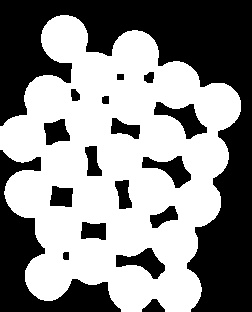
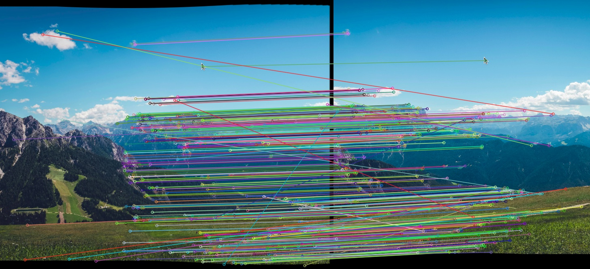

# VR_Assignment1_ADITYAAV_MT2024009

Setup and Run Instructions

1. Create output folder
2. Create input folder and add images in format img{i}.png

3. Execute the follwing commands

```bash
# Create virtual environment
python3 -m venv venv

# Activate virtual environment
source venv/bin/activate

# Install dependencies
pip install -r requirements.txt

# Run the script
python3 coin_detection.py
python3 image_stitching.py
```

# Coin Detection Using Hough Transform and Watershed Algorithm

## Hough Transform-Based Coin Detection

1.  **Read the Input Image**  
    Load the image from the specified path.  
    

2.  **Convert to Grayscale**  
    Convert the original image to grayscale for processing.  
    

3.  **Downsample the Image**  
    Reduce the image size while preserving details to optimize processing.  
    

4.  **Apply Sharpening**  
    Use the Laplacian method to enhance edges in the image.  
    

5.  **Apply Gaussian Blur**  
    Smooth the image to reduce noise and improve edge detection.  
    

6.  **Generate Canny Edge Detection Plots**  
    Display multiple images with varying Canny edge detection thresholds for selection.

7.  **Get User Input for Parameters**  
    The user provides values for Canny edge thresholds, minimum distance, circle detection threshold, and radius range.

8.  **Apply Hough Circle Transform**  
    Detect circular shapes in the image based on provided parameters.

9.  **Save and Display Results**  
    The detected circles are drawn on the image and saved.  
    
    

## Watershed Algorithm-Based Coin Detection

1.  **Read the Input Image**  
    Load the image from the specified path.  
    

2.  **Downsample the Image**  
    Reduce the image size while preserving details for processing.  
    

3.  **Convert to Grayscale**  
    Convert the image to grayscale to simplify processing.  
    

4.  **Apply Sharpening**  
    Enhance the edges of the image to improve feature extraction.  
    

5.  **Apply Gaussian Blur**  
    Reduce noise and smooth the image.  
    

6.  **Apply Thresholding**  
    Convert the grayscale image into a binary image using Otsu’s method.  
    

7.  **Apply Morphological Transformations**  
    Close small gaps in the thresholded image to enhance object separation.  
    

8.  **User Input for Overlapping Objects**  
    If coins are overlapping, apply erosion to refine segmentation.

9.  **Compute Distance Transform**  
    Compute the Euclidean distance of objects from the background.  
    

10. **Segment the Image Using Watershed Algorithm**  
    Assign different labels to objects and apply the Watershed algorithm to separate them.

11. **Save and Display Results**  
    The segmented image with detected coin boundaries is saved.  
    

# Image Stitching using SIFT and Cylindrical Projection

## Overview

This project implements an image stitching pipeline using SIFT (Scale-Invariant Feature Transform) for feature matching and cylindrical projection to correct distortions. The final panorama is created using homography-based warping and blending.

## Steps Involved

1. **Feature Detection and Matching**

   - Uses SIFT to detect keypoints and descriptors.
   - Brute Force Matcher (BFMatcher) is used to find correspondences between two images.
   - Only the top 75% best matches are retained.

     
   

2. **Homography Calculation**

   - The matched points are used to compute a homography matrix using RANSAC.
   - The matrix aligns the second image onto the base image.

3. **Cylindrical Projection**

   - Images are projected onto a cylindrical surface using a given focal length.
   - This corrects perspective distortion, making stitching more seamless.

4. **Image Warping and Blending**

   - The transformed second image is blended with the base image using masks.
   - This avoids visible seams and improves alignments.

   
